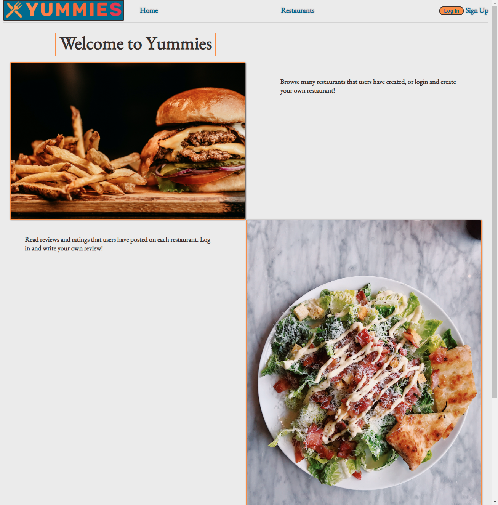
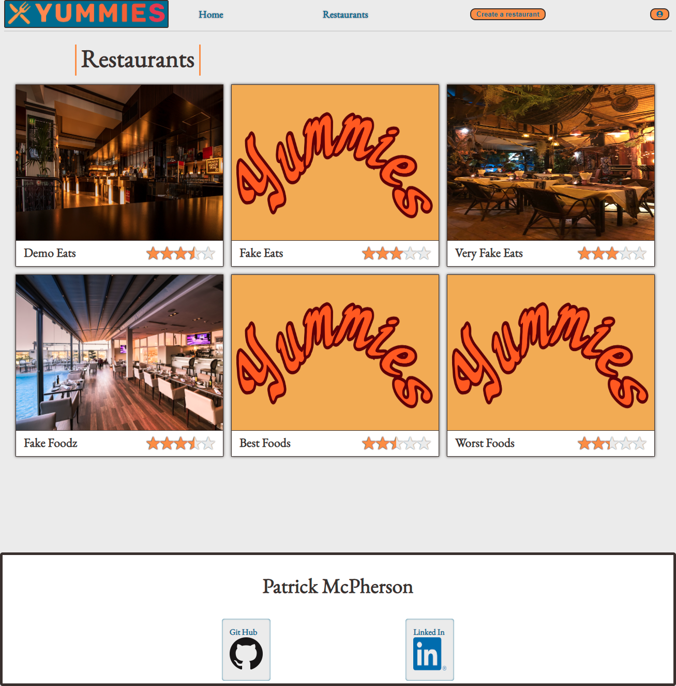
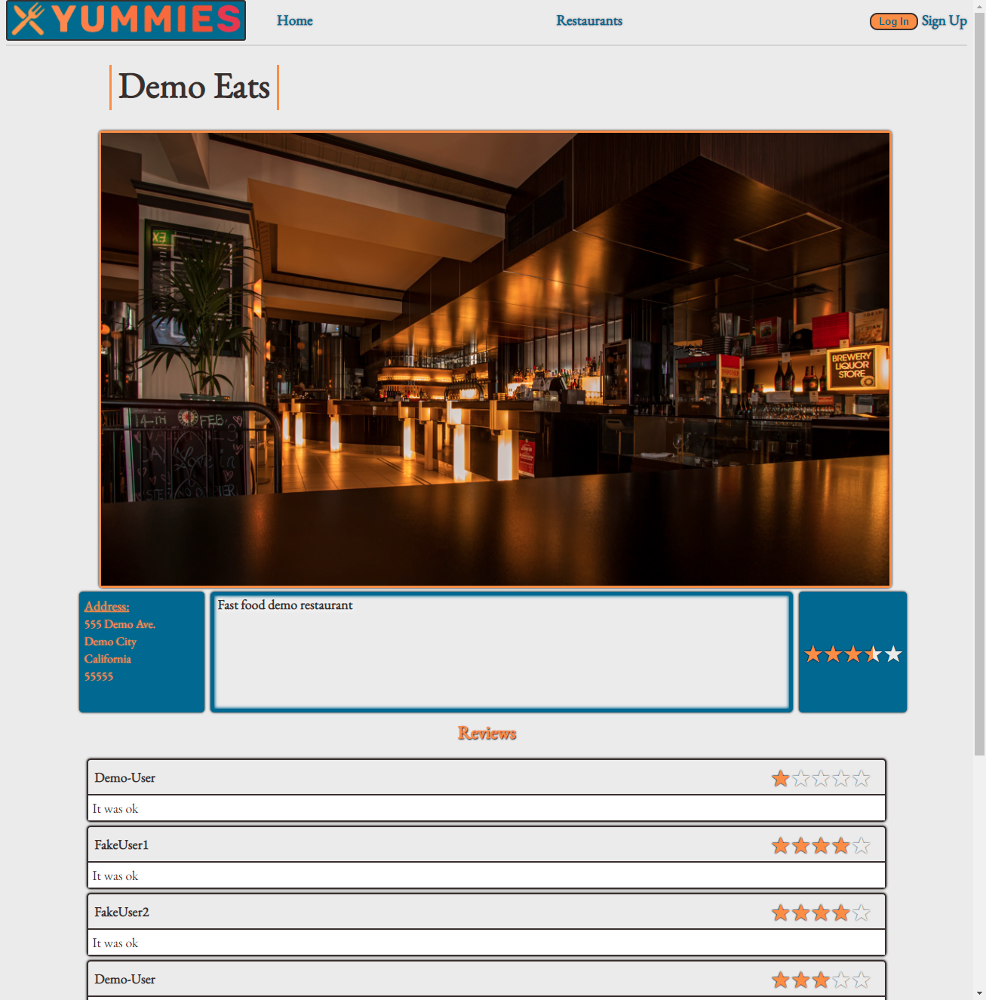
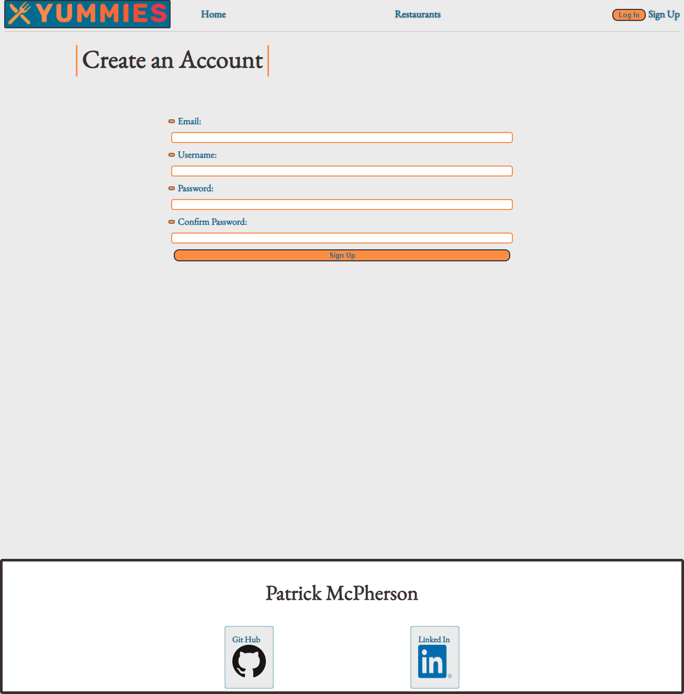
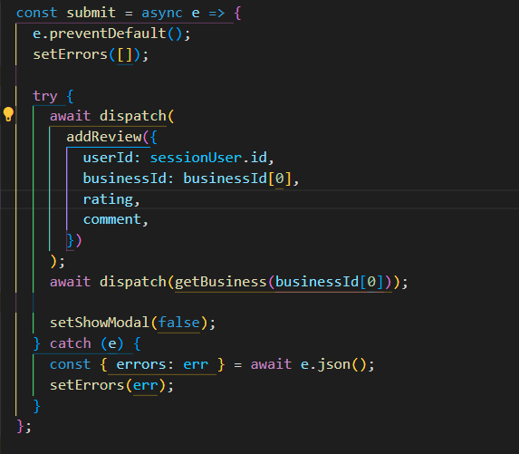

# Yummies

## Link to live site:

https://yummies-yelp-clone.herokuapp.com/

### Summary:

Yummies is a Yelp clone for finding good restaurants. Users can rate and review restaurants, or even create their own business.

---

## Screen Shots

### Home Page

### Restaurants Page

### Restaurant Details Page

### Sign Up Page

---

## Languages and tech

- CSS
- HTML
- Javascript

<!-- -->

- Express
- Node JS
- React
- Redux
- Postgres
- Sequelize

---

## Features

- Sign up / Log in (or Demo User)
- Create / Read / Update / Delete Restaurants
- Create / Read / Update / Delete Reviews

---

## How to run

### Front-end

- Run `npm install` in the _frontend_ directory
- And then `npm start`

### Back-end

- Run `npm install` in the _backend_ directory
- And then `npm start`

---

## TODOs & Future Features

- 404 Page
- AWS Image upload
- Likes for restaurants
- Search for restaurants
- Google Maps

---

## Technical Implementation Details

Updating the total review rating when a user creates, updates, or deletes a review gave me some trouble. Figuring out how to get that to re-render after those events seemed harder than I thought it would be. After some thought I realized using a dispatch I could re-render the business with it's updated review rating.

