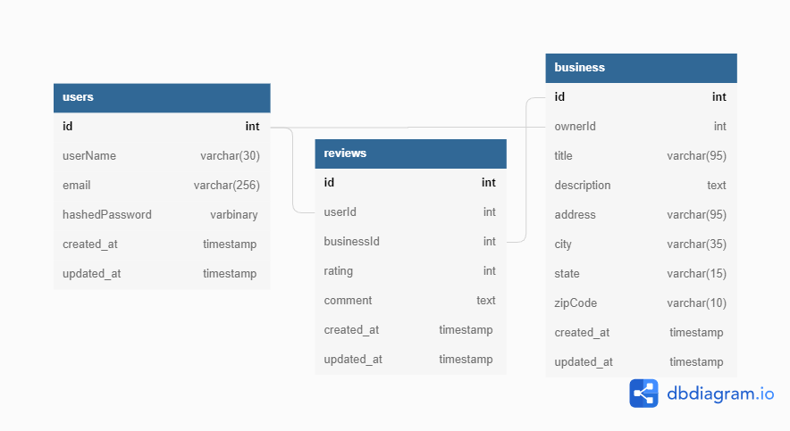

# Yummies

Yummies is a Yelp clone for reviewing, rating and finding good restaurants

# Store Shape

```
store = {
    session: {},
    businessDetail: {
        businessId: {
                businessData,
                user: {userData for business owner},
                reviews: {
                    reviewId: {
                            reviewData,
                            user: {userData of author}
                    },
                    optionalOrderedList: []
                }
        }
    },
    allBusinesses: {
        businessId: {
            businessData,
            user: {userData for business owner}
        },
        optionalOrderedList: []
    }
}
```

# Database Schema



| Project Name:      | Yummies                                                                                              |
| ------------------ | ---------------------------------------------------------------------------------------------------- |
| Clone:             | Yelp                                                                                                 |
| Feature List:      | https://github.com/Patricus/yummies/wiki/Feature-List                                                |
| DB Schema Diagram: | https://github.com/Patricus/yummies/wiki/Database-Schema                                             |
| Github:            | https://github.com/Patricus/yummies                                                                  |
| Scorecard:         | https://docs.google.com/spreadsheets/d/1vL2WYkjoabmHcvXTzYA17KetT6taJSsOs4etr3ozCqw/edit?usp=sharing |
| Live Link:         | https://yummies-yelp-clone.herokuapp.com/                                                            |
